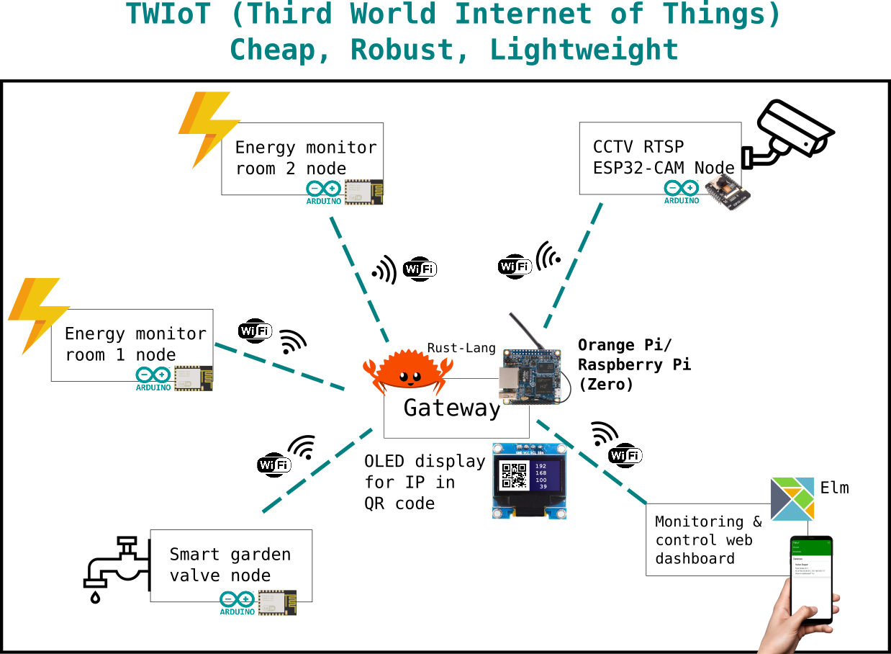

# TWIoT



Compilation of hacky internet of things schematics & codes/scripts which aim to help monitor and automate things around my house--in a third-world country--as cheap and robust as possible.

### Ecosystem
The ecosystem mostly uses the programming language Rust and Elm, which are the most robust programming languages in the market. Machine-to-machine communication uses MQTT while storage uses SQLite. MQTT is chosen because it is one of the most lightweight protocols which is compatible with Arduino + ESP8266/ESP32.

### Submodules
To init submodules, execute:
```
git submodule update --init --recursive
```

### (Dev) updating submodules
To update all submodules, execute:
```
git submodule foreach git pull origin main
```

Roadmap:
- [Gateway - Orange Pi Zero (100%)](https://github.com/vmasdani/twiot-gateway)
  - Generic devices & sensors database (100%)
  - OLED QR view (100%)
  - Management Console Frontend (100%)
- Smart Garden (75%)
  - Gateway backend (50%)
    - Manual watering schedule (100%)
    - Automatic watering (0%)
  - Actuators (100%)
    - [Solenoid valve controller (100%)](https://github.com/vmasdani/twiot-smart-garden-valve)
  - Sensors (0%)
    - Soil Moisture Logger (0%)
- Energy Monitor (0%)
  - Gateway backend (0%)
    - Rooms catalog (0%)
  - Sensors (0%)
- CCTV (0%)
  - CCTV devices catalog (0%)
  - RTSP proxy (0%)
